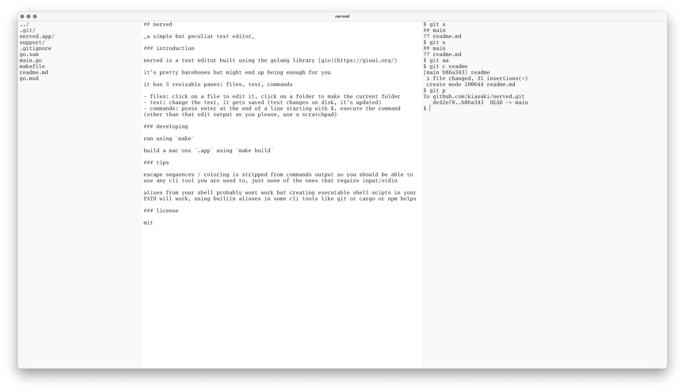

## nerved

_a simple but peculiar text editor_

### introduction

nerved is a text editor built using the golang library [gio](https://gioui.org/)

it's pretty barebones but might end up being enough for you

it has 3 resizable panes: files, text, commands

- files: click on a file to edit it, click on a folder to make the current folder
- text: change the text, it gets saved (text changes on disk, it's updated)
- commands: press enter at the end of a line starting with $, execute the command (other than that edit output as you please, use a scratchpad)

### developing

run using `make`

build a mac osx `.app` using `make build`

### screenshot

### tips

escape sequences / coloring is stripped from commands output so you should be able to use any cli tool you are used to, just none of the ones that require input/stdin

alises from your shell probably wont work but creating executable shell scipts in your PATH will work, using builtin aliases in some cli tools like git or cargo or npm helps 

### license

mit